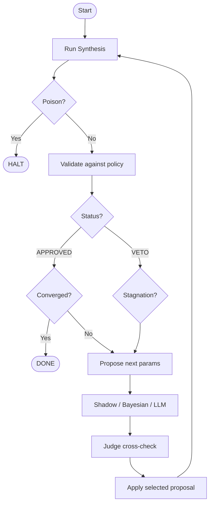

# AIV-DSE -- Agentic Design Space Exploration

An AI agent that automatically tunes hardware chip designs — running experiments,
checking results, and proposing better settings until the design meets all targets.

**Key features:**
- **Autonomous loop**: Runs dozens of experiments without human babysitting
- **Three search strategies**: Dumb heuristic, Bayesian math, and LLM reasoning — all compared
- **Adversarial validation**: Two AIs cross-check each other. Disagreement triggers human review
- **Multi-objective Pareto front**: Finds the best tradeoffs instead of collapsing everything to one score
- **Governance-first**: AI proposes, deterministic code decides. AI never writes final state directly
- **LangGraph state machine**: Production-ready cyclic workflow with checkpointing
- **191 tests**, all mocked. No API keys needed for CI
- **Langfuse observability**: Full LLM call tracing
- **Gradio UI**: Web interface for report validation and history

---

## For Beginners: What Problem Does This Solve?

### The hardware design tuning problem

When engineers design a chip or hardware block, they have to choose dozens of settings
(called **directives** or **knobs**). Each knob affects three competing goals:

| Goal | What it means | Example target |
|------|--------------|----------------|
| **Latency** | How fast the chip runs | Under 10,000 ns |
| **Area** | How much chip space it uses | Under 50,000 units |
| **Power** | How much power it consumes | Under 500 mW |

The problem: **improving one metric often worsens another.** For example:
- Unrolling a loop 8x makes it faster (lower latency) but uses more chip area
- Reducing clock speed reduces area but increases latency
- There is no single "best" setting — it depends on what matters most to you

Manually exploring all combinations is slow, expensive, and error-prone. This project
automates that process using an AI agent.

---

## How It Works: The Agentic Loop

Instead of guessing once, AIV-DSE runs an **iterative loop** — like a scientist
running controlled experiments and adjusting based on results.

```
                    ┌─────────────────────────────────────────┐
                    │           THE DSE LOOP                  │
                    │                                         │
  You provide:      │  1. Run synthesis with current settings │
  - Initial params  │         ↓                               │
  - Policy targets  │  2. Parse the results report            │
                    │         ↓                               │
                    │  3. Validate: did we meet all targets?  │
                    │         ↓                               │
                    │  4. If yes → add to Pareto front        │
                    │     If no  → figure out what to change  │
                    │         ↓                               │
                    │  5. Three strategies propose new params │
                    │     (Shadow, Bayesian, LLM)             │
                    │         ↓                               │
                    │  6. LLM Judge cross-checks the proposal │
                    │         ↓                               │
                    │  7. Apply best proposal → go to step 1  │
                    │                                         │
                    │  STOP when: converged / max iters /     │
                    │             critical error detected      │
                    └─────────────────────────────────────────┘
```

Each iteration, the system learns from the previous run. Over 10–20 iterations
it zero-in on a design that satisfies all constraints — or tells you it's impossible
and what the closest achievable values were.

---

## Architecture Deep Dive: Why Each Decision Was Made

### Decision 1: Why a loop at all? (vs. one-shot AI)

You could just ask an LLM: *"What HLS settings should I use?"* and apply the answer.
The problem: LLMs hallucinate, and hardware physics are complex. The first guess is
usually wrong.

The loop approach uses **real synthesis feedback** to correct mistakes:

```
Iteration 1: unroll=4, pipeline=2  →  latency=12500 ns  ← TOO SLOW (target: <10000)
Iteration 2: unroll=8, pipeline=3  →  latency=9800  ns  ← PASS
                                       area=52000 units  ← TOO BIG (target: <50000)
Iteration 3: unroll=6, pipeline=3  →  latency=9200  ns  ← PASS
                                       area=47000 units  ← PASS
                                       power=310 mW      ← PASS → APPROVED!
```

**Why it matters:** The AI uses actual synthesis results, not guesses. Each run gives
it more information to work with.

---

### Decision 2: Why three strategies? (Shadow / Bayesian / LLM)

No single strategy wins every time. Running all three lets the system compare them:

| Strategy | What it does | Best for |
|----------|-------------|---------|
| **Shadow (heuristic)** | Simple rule: if latency is violated, increase unroll by 1 | Baseline benchmark — proves the others add value |
| **Bayesian (Optuna)** | Builds a statistical model of the search space; focuses on promising regions | When you have 5+ runs of data and want math-guided search |
| **LLM advisor** | Reads the full run history and reasons about multi-dimensional tradeoffs | When constraints are interrelated in non-obvious ways |

The shadow heuristic is intentionally "dumb" — it's a benchmark. If the LLM doesn't
outperform a one-line rule, the LLM isn't adding real value.

```
After 10 runs:
  Shadow converged at iteration 8   (unroll went 4→5→6→7→... slowly)
  Bayesian converged at iteration 5  (jumped to unroll=6, pipeline=3 early)
  LLM converged at iteration 4      (combined unroll + loop_merge in one shot)
```

---

### Decision 3: Why LLM-as-Judge? (Adversarial validation)

When an LLM proposes a parameter change, how do you know if the reasoning is sound?
You ask a second LLM to check it — from a skeptical angle.

```
PRIMARY LLM (Claude):
  "Reduce unroll from 8 to 4. Area is 52000, 4% over budget.
   This will bring area down by ~25% at cost of ~10% latency increase.
   Latency has 15% headroom, so this is safe."

JUDGE LLM (cross-checks):
  "I agree the direction is right. However, the latency estimate is
   optimistic — unroll reduction also affects pipeline depth interaction.
   Recommend also reducing pipeline from 3 to 2 to avoid timing closure risk."

OUTCOME: Disagreement → proposal escalated to human review
```

**Why it matters:** A single LLM can be confidently wrong. Two LLMs disagree when
the reasoning is shaky — that disagreement is a signal to involve a human.

The governance rule: **the deterministic validator always has final say.** The LLM
can propose whatever it wants, but the validator checks the actual numbers. LLMs
never directly write state.

---

### Decision 4: Why a Pareto Front? (Multi-objective optimization)

With three competing goals, there is no single "best" design. There is a set of
designs where you can't improve one metric without worsening another. That set is
called the **Pareto front**.

**Example with three designs:**

```
Design A:  latency=8000, area=48000, power=480  (fast, small, near power limit)
Design B:  latency=9200, area=42000, power=310  (slightly slower, much smaller, low power)
Design C:  latency=7500, area=55000, power=290  (fastest, but too big — violates area)

Design C is dominated by nothing — it's fast and low power — but violates area.
Design A and B are both on the Pareto front: neither is strictly better than the other.

If power matters most to you → pick Design B
If latency matters most → pick Design A
```

Without a Pareto front, a single-score optimizer might collapse all three into
`score = 0.4*latency + 0.3*area + 0.3*power` and return one answer. But that
answer depends entirely on your weights — and you might not know your weights upfront.

**The loop keeps the full Pareto front and lets you choose at the end.**

```powershell
# Weight-based selection at the end (latency priority)
python -m aiv_dse.run_loop --weight-latency 0.7 --weight-area 0.15 --weight-power 0.15
```

The NSGA-II sampler (used by the Bayesian strategy) is designed specifically to
explore multiple objectives simultaneously — it won't sacrifice all area gains just
to improve latency by 1%.

---

### Decision 5: Why LangGraph? (State machine over while loop)

The original implementation was a Python `while` loop. LangGraph replaces it with
an explicit **state machine** — a graph where each node is a step and edges define
what happens next.

```
while loop (before):               LangGraph graph (after):
─────────────────────              ──────────────────────────────
while not done:                    synthesize ──→ validate ──→ record
  run_synthesis()                       ↑                        ↓
  validate()                            │                  check_terminal
  propose()                             │                   /          \
  apply()                           apply ←── propose    END           END
```

**Why it matters for production:**
- **Checkpointing**: if the run crashes at iteration 7, restart from iteration 7 — not 0
- **Replay**: re-run any iteration with different parameters for debugging
- **Visibility**: the graph structure is explicit — you can see all possible paths
- **Testing**: each node is a pure function, easy to unit test in isolation

---

### Decision 6: What is "Governance-First"?

This is the core safety principle of the whole system:

```
WITHOUT governance:                WITH governance (this project):
────────────────────               ────────────────────────────────
LLM sees bad result                LLM sees bad result
LLM decides what to change         LLM PROPOSES what to change
LLM writes new config              Deterministic validator CHECKS the proposal
                                   Validator either applies or rejects it
                                   LLM never writes state directly
```

**Why it matters:** LLMs can be confidently wrong about numbers. The deterministic
validator uses hard-coded policy rules (`area must be < 50000`) — no LLM can override
that. This makes the system auditable and safe for production use.

---

## Full Architecture (Component Map)

```
┌─────────────────────────────────────────────────────────────────┐
│                         AIV-DSE SYSTEM                          │
│                                                                 │
│  ┌──────────┐    ┌──────────────┐    ┌────────────────────┐    │
│  │ IP Spec  │───▶│ Spec Planner │───▶│  Initial Params    │    │
│  │ (txt/pdf)│    │   (LLM)      │    │  (SynthesisParams) │    │
│  └──────────┘    └──────────────┘    └─────────┬──────────┘    │
│                                                │               │
│              ┌─────────────────────────────────▼──────┐        │
│              │           LANGGRAPH STATE MACHINE       │        │
│              │                                        │        │
│              │  ┌──────────┐   ┌──────────────────┐  │        │
│              │  │Synthesize│──▶│     Validate      │  │        │
│              │  │(HLS tool)│   │  (policy checker) │  │        │
│              │  └────▲─────┘   └────────┬─────────┘  │        │
│              │       │                  ▼             │        │
│              │  ┌────┴─────┐   ┌──────────────────┐  │        │
│              │  │  Apply   │   │      Record       │  │        │
│              │  │  params  │   │ (history, Pareto, │  │        │
│              │  └────▲─────┘   │    CSV log)       │  │        │
│              │       │         └────────┬─────────┘  │        │
│              │  ┌────┴─────┐            ▼             │        │
│              │  │ Propose  │   ┌──────────────────┐  │        │
│              │  │ params   │◀──│  Check Terminal  │  │        │
│              │  └──────────┘   │(converged/halt?) │  │        │
│              │                 └────────┬─────────┘  │        │
│              └─────────────────────────┼────────────┘        │
│                                        │ END                   │
│  ┌─────────────────────────────────────▼──────────────────┐   │
│  │                    PROPOSE NODE                         │   │
│  │                                                        │   │
│  │  ┌─────────────┐  ┌──────────────┐  ┌─────────────┐  │   │
│  │  │   Shadow    │  │   Bayesian   │  │     LLM     │  │   │
│  │  │ (heuristic) │  │  (NSGA-II)   │  │  (advisor)  │  │   │
│  │  └─────────────┘  └──────────────┘  └──────┬──────┘  │   │
│  │                                             │          │   │
│  │                                    ┌────────▼───────┐  │   │
│  │                                    │   LLM Judge    │  │   │
│  │                                    │ (cross-check)  │  │   │
│  │                                    └────────────────┘  │   │
│  └────────────────────────────────────────────────────────┘   │
│                                                                 │
│  ┌──────────────────┐   ┌─────────────────┐                   │
│  │  Langfuse traces │   │   Gradio UI     │                   │
│  │  (observability) │   │  (web interface)│                   │
│  └──────────────────┘   └─────────────────┘                   │
└─────────────────────────────────────────────────────────────────┘
```

---

## Quick Start

### Setup

```powershell
cd aiv_dse
python -m venv .venv
.\.venv\Scripts\Activate.ps1
pip install -r requirements.txt
cp .env.example .env   # edit with your API keys
```

### Run without API keys (simulated HLS)

```powershell
$env:PYTHONPATH='src'

# Validate a single report
python -m aiv_dse.run_stage1 samples/report_pass.json     # APPROVED
python -m aiv_dse.run_stage1 samples/report_fail.json     # VETO
python -m aiv_dse.run_stage1 samples/poison_report.json   # HALT

# Run the full loop (Bayesian strategy, no LLM calls needed)
python -m aiv_dse.run_loop --backend graph --strategy bayesian --max-iters 10 --seed 42

# See all loop stages explained
python -m aiv_dse.run_loop --explain
```

### Run with LLM (needs `ANTHROPIC_API_KEY` in `.env`)

```powershell
$env:PYTHONPATH='src'

# LLM-driven loop with LLM-as-judge
python -m aiv_dse.run_loop --strategy llm --sdk anthropic --max-iters 10

# LLM reads IP spec first, then runs loop
python -m aiv_dse.run_loop --spec specs/ip_spec_example.txt --sdk anthropic
```

### Gradio web UI

```powershell
pip install gradio
python app.py
# Open http://localhost:7860
```

---

## How it differs from AIV-DE (sister project)

| | AIV-DE | AIV-DSE |
|---|---|---|
| Pattern | One-shot decision pipeline | Iterative exploration loop |
| Agents | Sequential: analyst → architect → validator → writer | Cyclic: synthesize → validate → propose → apply |
| State | Single-run trace | Multi-run history with Pareto front |
| Human role | Escalation target (HITL on failure) | Active steering at each iteration |
| Output | Architecture Decision Record (ADR) | Engineering Decision Record (EDR) |

---

## Phase 4: HLS Directives (11 Tunable Knobs)

| Knob | CLI flag | Effect |
|------|----------|--------|
| `unroll_factor` | `--unroll` | Unroll loops: faster but more area |
| `pipeline_depth` | `--pipeline` | Pipeline stages: throughput vs. latency tradeoff |
| `clock_period_ns` | `--clock` | Clock target: slower clock = easier timing closure |
| `array_partition_factor` | `--partition` | Memory access parallelism |
| `clock_slack_ns` | `--slack` | Timing margin: positive = relaxed |
| `dpo_mode` | `--dpo` | Datapath optimization: `DPO_AUTO_ALL` / `OPT` / `EXPR` |
| `flatten` | `--flatten` | Flatten hierarchy: lower latency, higher area |
| `inline` | `--inline` | Inline functions: similar to flatten, less aggressive |
| `loop_merge` | `--loop-merge` | Merge adjacent loops: lower latency |
| `bitwidth_reduce` | `--bitwidth-reduce` | Auto bitwidth: less area + power |
| `resource_sharing` | `--resource-sharing` | Share HW resources: less area, slight power increase |

```powershell
$env:PYTHONPATH='src'

# All directives enabled (Bayesian will explore their interactions)
python -m aiv_dse.run_loop --strategy bayesian --dpo DPO_AUTO_OPT --flatten --inline --loop-merge --bitwidth-reduce --resource-sharing --max-iters 15
```

### Report Parsing

Parses HLS tool output files:
- `timing.rpt` → latency_ns, clock_period_ns, slack_ns
- `area.rpt` → area_units, breakdown (LUTs, FFs, BRAM, DSP)
- `power.rpt` → power_mw, breakdown (dynamic, static)
- `synth.log` → warnings, suggestions, exit_status

### TCL Config Writer

Generates HLS-compatible config files from `SynthesisParams`:
- `project.tt2.tcl` -- clock period, DPO mode
- `block.config` -- unroll, pipeline, partition, flatten, inline, loop_merge, bitwidth_reduce, resource_sharing
- `block.procs.tcl` -- clock slack

---

## Phase 6: Multi-Objective Pareto Front

By default the loop tracks a Pareto front rather than optimizing a single score.

### How convergence works

1. Each APPROVED design is added to the Pareto front
2. A design is removed if a newer design dominates it on all three objectives
3. The loop stops when the front size is **stable for 3 consecutive updates** — meaning no better tradeoffs are being found

### Selecting a winner

After the loop finishes, the best point on the front is picked using weights:

```powershell
# Latency is most important
python -m aiv_dse.run_loop --strategy bayesian --weight-latency 0.7 --weight-area 0.15 --weight-power 0.15

# All objectives equal
python -m aiv_dse.run_loop --strategy bayesian --max-iters 10 --seed 42

# Legacy: single-objective mode (collapses to one score)
python -m aiv_dse.run_loop --strategy bayesian --no-multi-objective --max-iters 5
```

---

## Iteration Loop Flowchart



---

## LangGraph State Machine

### Graph structure

```
synthesize -> validate -> record -> check_terminal -> propose -> apply -> synthesize
                                          |
                                          v
                                         END (convergence / halt / max_iters)
```

### Node reference

| Node | What it does |
|------|-------------|
| `synthesize` | Run HLS synthesis with current params |
| `validate` | Check metrics against policy (includes poison detection) |
| `record` | Update history, Pareto tracker, CSV log |
| `check_terminal` | Check convergence, max iterations, halt conditions |
| `propose` | Run all three strategies; judge cross-checks the LLM proposal |
| `apply` | Apply the selected strategy's proposal to state |

### Backends

```powershell
$env:PYTHONPATH='src'

# LangGraph backend (recommended for production)
python -m aiv_dse.run_loop --backend graph --strategy bayesian --max-iters 10

# Direct LangGraph entry point
python -m aiv_dse.graph --strategy bayesian --max-iters 10 --seed 42

# Legacy while-loop backend (still supported)
python -m aiv_dse.run_loop --backend loop --strategy bayesian --max-iters 10
```

---

## Gradio Web UI

```powershell
pip install gradio
python app.py
# Opens at http://localhost:7860
```

Features:
- Paste a JSON report, get APPROVED / VETO / ESCALATE / HALT with violation details
- View recent run history in a table
- Pre-loaded example reports for quick testing

### Deploy to Hugging Face Spaces

```bash
pip install huggingface_hub
huggingface-cli login
huggingface-cli repo create aiv-dse --type space --space-sdk gradio
```

---

## Langfuse Observability

All LLM calls are traced. Add to `.env` to enable:

```env
AIVDSE_USE_LANGFUSE=1
LANGFUSE_SECRET_KEY=sk-lf-...
LANGFUSE_PUBLIC_KEY=pk-lf-...
LANGFUSE_HOST=https://cloud.langfuse.com
```

### Traced functions

| Function | Description |
|----------|-------------|
| `propose_adjustments` | LLM proposes constraint changes |
| `propose_synth_params` | LLM proposes synthesis param changes |
| `judge_proposal` | Second LLM cross-checks the proposal |
| `judge_code_advisory` | Second LLM cross-checks code suggestions |
| `plan_from_spec` | LLM reads IP spec and proposes initial config |
| `advise_code_changes` | LLM suggests code-level optimizations |

Tracing is opt-in. When `AIVDSE_USE_LANGFUSE=0`, the `@observe` decorator is a no-op.

---

## Tests

```powershell
$env:PYTHONPATH='src'

# All tests (191 tests, no API key needed)
python -m pytest tests/ -v

# By stage/phase
python -m pytest tests/test_report_parser.py tests/test_validator.py tests/test_state.py -v        # Stage 1
python -m pytest tests/test_stagnation.py tests/test_llm_models.py tests/test_edr_writer.py -v    # Stage 2
python -m pytest tests/test_dummy_hls.py tests/test_loop.py -v                                     # Stage 3
python -m pytest tests/test_extended_params.py tests/test_rpt_parser.py tests/test_tcl_writer.py tests/test_csv_logger.py -v  # Phase 4
python -m pytest tests/test_pareto.py -v                                                            # Phase 6
python -m pytest tests/test_graph.py -v                                                             # Phase 7 (LangGraph)
python -m pytest tests/test_tracing.py -v                                                           # Tracing
```

---

## Privacy

- No LangSmith or external telemetry
- Prompts contain only synthetic data (metrics + policy thresholds)
- All logging is local opt-in (`AIVDSE_LOG_LLM_IO=1` writes to `out/debug_llm/`)
- Tests mock all LLM calls -- no real API calls in test suite
